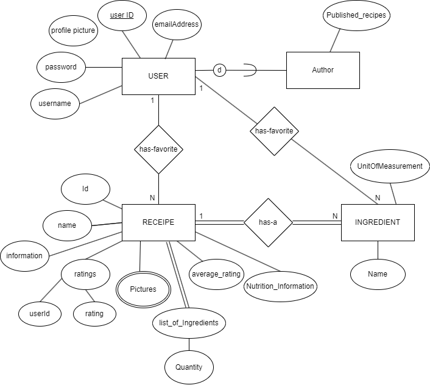
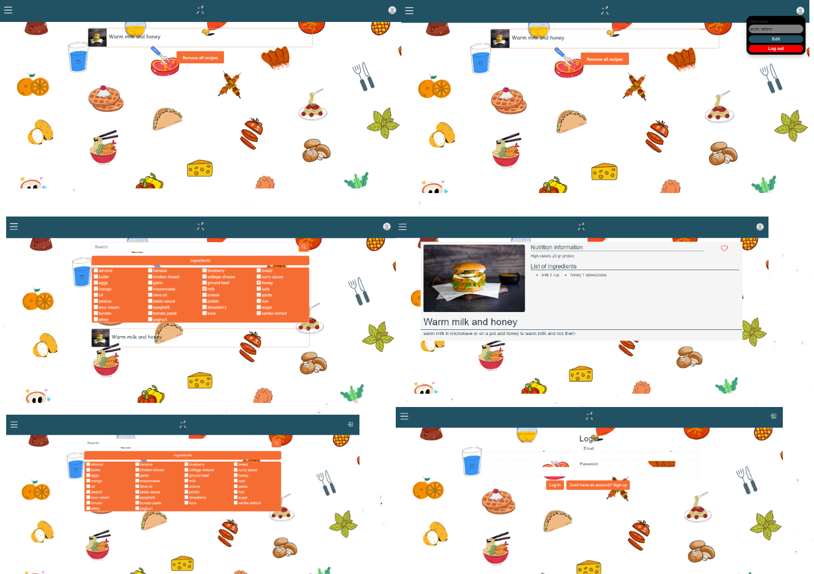

# Backend and Frontend Template

## Getting started

```bash
# Clone repository
# Change into the directory
# Setup backend
cd server && npm install
npm run dev

# Setup frontend
cd client && npm install
npm run serve
```

> Check out the detailed instructions for [backend](./server/README.md) and [frontend](./client/README.md).

## System Definition (MS0)

### Purpose

The purpose of our website is to simplify the cooking experience for users by 
providing them with delicious recipes based on the ingredients they already 
have in their kitchen. We aim to make meal planning and preparation more 
accessible, efficient, and budget-friendly for our users, particularly those 
with limited time or resources.

### Pages

 * Home Page: Our homepage features a central search bar complemented by advanced filtering and ingredient management tools. You can also tailor your recipe search by selecting your desired preparation time filter or other filtering options.
* Login Page: This page provides users with a sign-in form where they must input their username/email and * password to access their accounts.
* Sign-up Page: This page offers a form similar to the login page, with additional fields for users who have not yet registered on our website.
* Dashboard Page: This page is accessible to logged-in users who wish to modify their information, visit their favorite recipes page, and more.
Favorite Recipe Page: This page displays a list of recipes that users have previously added to their favorites.
* Recipe Page: After the central search bar finds recipes matching the user's customization, clicking on each recipe takes the user to a specific recipe page containing ratings, explanations, preparation time, photos, and more.
* Favorite Ingrediant list: users can save their favorite ingredient or set of their favorite ingredients in this page, and use, or combine them later for searching for new recipes


### Entity-Relationship (ER) Diagram



## Teaser (MS3)


